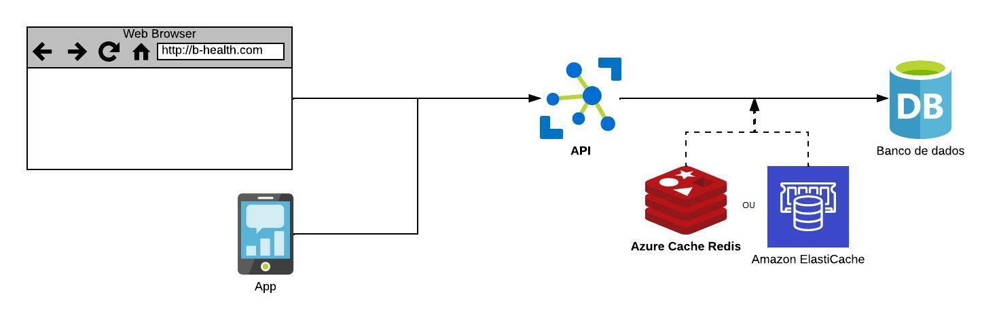

**Solução 02**

- Projeto de frontend apartado do backend.
- Desenvolver API para o agendamento de exames, pagamentos, consultas dos dados do hospital. Com isso, o front consome suas rotas.
- Aplicar o pattern Singleton para conexão com o banco de dados.
- Utilizar Repository Pattern para isolar a camada de acesso a dados (DAL), impulsionando o uso de injeção de dependência.
- Para CRUDs, utilização de algum Micro ORM para usar "query pura", caso seja um BD SQL.
- Criação de índices em banco de dados caso necessário.
- Para CRUDs NoSQL, otimização de estrutura json caso necessário (genérica adaptativa).
- Aplicação de cache no Redis.

Desenho
